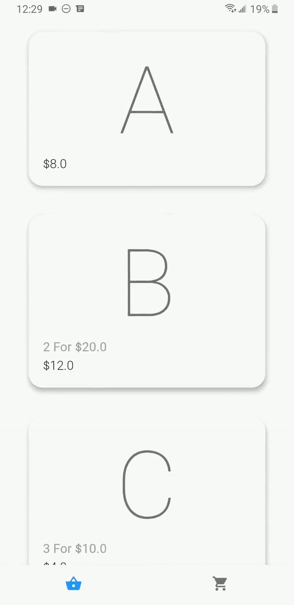

# UNiDAYS Discounts Coding Challenge App

This app is designed for the UNiDAYS Discounts Coding Challenge. It is powered by Flutter, with all the code being written in Dart. 

## Introduction

In order to complete this challenge, I experimented with implementing the [strategy pattern](https://en.wikipedia.org/wiki/Strategy_pattern). This can be explored in the [discount.dart](https://github.com/joeyvanlierop/tech-placement-challenge/blob/master/lib/shopping_system/discount.dart) file. The strategy pattern allowed for each unique discount to implement a custom algorithm which can be applied to any item and easily adjusted. This worked very well as it allowed for flexiblity of the discount objects, and makes future expansion trivial. 

This project includes 3 pre-made discount classes including: [DiscountNForPrice](https://github.com/joeyvanlierop/tech-placement-challenge/blob/1880ae0b808b986d4ea5bf29f5f43b4b38db2181/lib/shopping_system/discount.dart#L30), [DiscountBuyNGetM](https://github.com/joeyvanlierop/tech-placement-challenge/blob/1880ae0b808b986d4ea5bf29f5f43b4b38db2181/lib/shopping_system/discount.dart#L72), and [DiscountNForM](https://github.com/joeyvanlierop/tech-placement-challenge/blob/1880ae0b808b986d4ea5bf29f5f43b4b38db2181/lib/shopping_system/discount.dart#L110) 

More specific documentation is included in [basket.dart](https://github.com/joeyvanlierop/tech-placement-challenge/blob/master/lib/shopping_system/basket.dart), [discount.dart](https://github.com/joeyvanlierop/tech-placement-challenge/blob/master/lib/shopping_system/discount.dart), and [item.dart](https://github.com/joeyvanlierop/tech-placement-challenge/blob/master/lib/shopping_system/item.dart).

In order connect the shopping system business logic with the user interface, I utilized [provider pattern](https://pub.dev/packages/provider). This was originally implemented using the [bloc pattern](https://pub.dev/packages/bloc), however provider ended up being the surperior solution as the state (a basket object) was not mutable. Also, because this is a smaller-scale project, BLoC resulted in an excess of boilerplate code.

## Building The App

In order to build and run the app, you can try following the instructions [here](https://flutter.dev/docs/deployment/android). Otherwise, try the following:
* Run `flutter build apk --release` to build an Android apk. (I have not tested the app on iOS, however it should work)
* Navigate to the generated apk in `build\app\outputs\apk\release` and install in on to your mobile device.

Or you can simply install the latest apk from the [releases](https://github.com/joeyvanlierop/tech-placement-challenge/releases).

## Showcase

  

---

# UNiDAYS Discounts Coding Challenge

## Introduction

This challenge is for you to make use of your problem solving skills as well as demonstrate your understanding of good object-oriented programming and SOLID design principles.

At UNiDAYS our business is built on providing discounts to students. Your challenge is to build a basic discount system that applies discounts to an online shopping order and calculates the total price based on a set of pricing rules.

You may complete the challenge in any programming language you wish.

## Pricing Rules

| Item | Price  | Discount |
| ---- | ------ | -------- |
| A    | £8.00  | None |
| B    | £12.00 | 2 for £20.00 |
| C    | £4.00  | 3 for £10.00 |
| D    | £7.00  | Buy 1 get 1 free |
| E    | £5.00  | 3 for the price of 2 |

## Delivery Charges

Delivery charge £7.00

Free delivery on orders over £50.00 (inclusive)

## Interface

Implement a `UnidaysDiscountChallenge` class with two public methods.

1. `AddToBasket` - Pass in an item
2. `CalculateTotalPrice` - Calculate and return the total price, result should include the following
    - `Total` - Total price of all items after applying any discounts
    - `DeliveryCharge` - The delivery charge for the order

It should be possible to initialise your `UnidaysDiscountChallenge` class with the pricing rules. The example below shows how the interface might be used.

```
example = new UnidaysDiscountChallenge(pricingRules);

example.AddToBasket(itemOne);
example.AddToBasket(itemTwo);

result = example.CalculateTotalPrice();

totalPrice = result.Total;
deliveryCharge = result.DeliveryCharge;
overallTotal = totalPrice + deliveryCharge;
```

## Example Test Cases

| Items          | Total  | Delivery Charge |
| -------------- | ------ | --------------- |
| _None_         | £0.00  | £0.00 |
| A              | £8.00  | £7.00 |
| B              | £12.00 | £7.00 |
| C              | £4.00  | £7.00 |
| D              | £7.00  | £7.00 |
| E              | £5.00  | £7.00 |
| BB             | £20.00 | £7.00 |
| BBB            | £32.00 | £7.00 |
| BBBB           | £40.00 | £7.00 |
| CCC            | £10.00 | £7.00 |
| CCCC           | £14.00 | £7.00 |
| DD             | £7.00  | £7.00 |
| DDD            | £14.00 | £7.00 |
| EE             | £10.00 | £7.00 |
| EEE            | £10.00 | £7.00 |
| EEEE           | £15.00 | £7.00 |
| DDDDDDDDDDDDDD | £49.00 | £7.00 |
| BBBBCCC        | £50.00 | £0.00 |
| ABBCCCDDEE     | £55.00 | £0.00 |
| EDCBAEDCBC     | £55.00 | £0.00 |

## Deliverables

You should provide a copy of your code in a publicly accessible location (e.g. Github, Bitbucket etc).

Your solution should include documentation describing how to build and run your code as well your approach to the problem. 

We're not too fussy about what platform your program runs on, but we do require that we're able to build and run your code ourselves.
